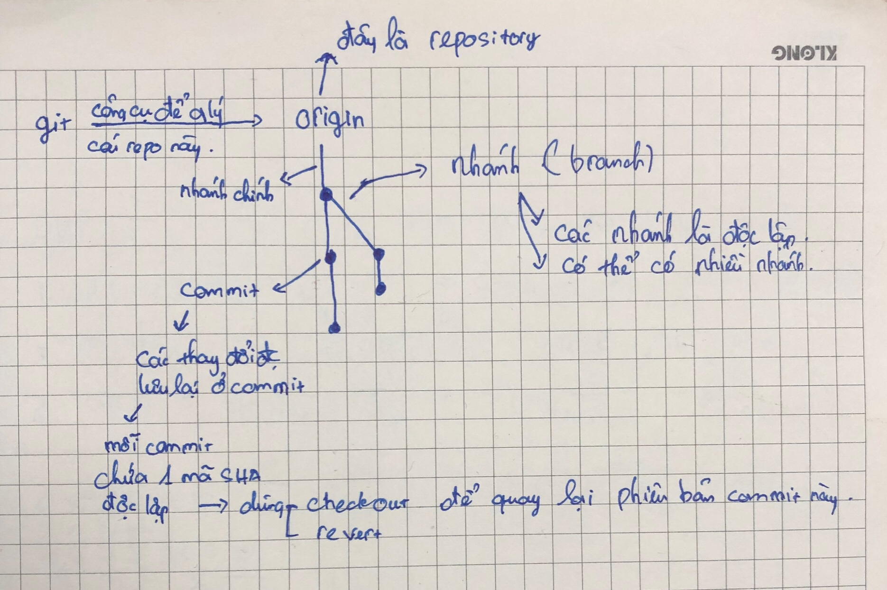
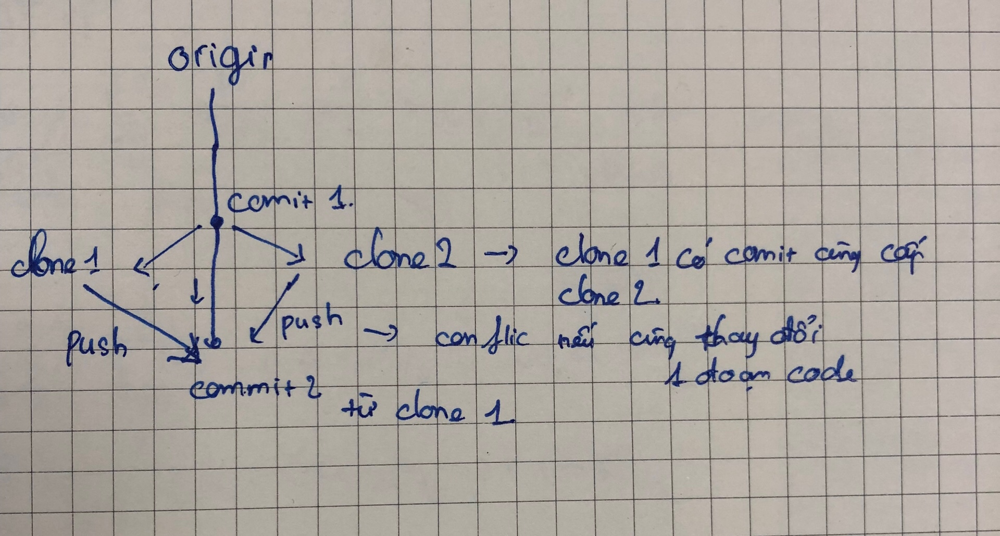
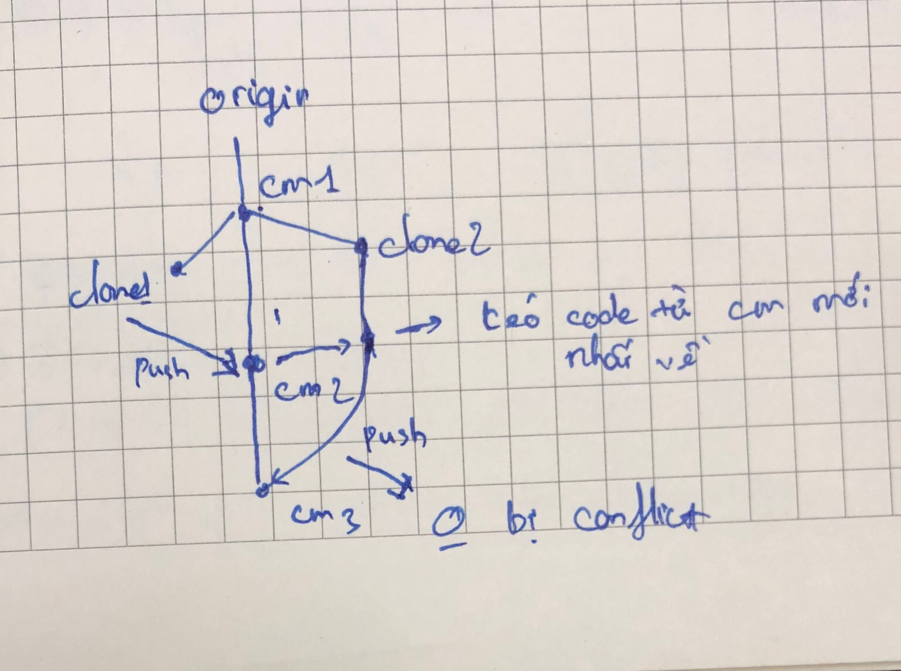

# Git
## Git là gì?
- Git là công cụ quản lý các phiên bản của các tập tin (VCS - Version Control System) 
- Git cung cấp các chức năng như:
    + Lưu trữ các phiên bản của các tập tin
    + Theo dõi các thay đổi của các tập tin
    + Khôi phục các phiên bản cũ
    + Tạo các nhánh (branch) để phát triển các tính năng mới, làm việc độc lập với nhau.

Như hình trên, repository được lưu trên cloud.
Khi làm việc, thì ta sẽ không thao tác trực tiếp trên cloud, mà sẽ dùng git để clone về. Mục đích là nhiều người có thể đồng thời làm việc với repo này.
Lúc này ta có bản local của repository. Mô hình giống trên ảnh.
- Tuy nhiên, ta sẽ gặp vấn đề khi đẩy code lên lại repo cloud.
## Chúng ta cần phân biệt rõ ràng giữa repo cloud và repo local (Mối quan hệ)
- Repo cloud: là repo trên cloud, chứa các phiên bản của các tập tin, nơi nhiều người có thể làm việc đồng thời.
- Repo local: là repo trên máy tính cá nhân, chứa các phiên bản của các tập tin, nơi mà mỗi người làm việc độc lập.

- 1 repo - n repo local
- n repo local -> push -> 1 repo cloud

## Vấn đề khi đẩy code lên repo cloud
- Do mỗi repo local là độc lập, khi đẩy code lên 1 repo cloud, có tiềm ẩn khả năng gây ra xung đột (conflict) giữa các phiên bản của các tập tin. (Cùng người cùng sửa 1 dòng code), từ các commit cùng cấp.

- Để giải quyết vấn đề này, ta cần phải đồng bộ lại các phiên bản của clone 2 và repo cloud. Sau đó push lên với một phiên bản mới (commit mới).
- Đồng bộ lại các phiên bản của repo local và repo cloud, ta sẽ dùng lệnh `git pull` để lấy về các phiên bản mới nhất của repo cloud.
- Sau khi đồng bộ, ta sẽ dùng lệnh `git push` để đẩy code lên repo cloud.

## Tại sao cần có các nhánh?
- Khi làm việc với repo cloud, ta sẽ không thao tác trực tiếp trên nhánh master, mà sẽ tạo ra các nhánh mới để làm việc. Sau khi hoàn thành, ta sẽ merge vào nhánh master.
- Dùng nhánh sẽ giúp ta đảm bảo tính toàn vẹn của nhánh master. Vì nhánh master chỉ được merge khi đã được kiểm tra kỹ lưỡng.
- Đồng thời branch giúp ta làm việc độc lập trên các chức năng khác nhau, giảm thiểu trường hợp `quá nhiều người cùng thao tác trên 1 nhánh`.

## Các lệnh cơ bản của git
- Trước khi vào các lệnh cơ bản, ta cần phải hiểu rõ ràng về các khái niệm sau:
    + repo: là thư mục chứa các tập tin, các phiên bản của các tập tin, chứa file .git
    + Commit: là một phiên bản của các tập tin, được lưu trữ trên repo local.
    + Branch: là một nhánh, được tạo ra từ một commit nào đó. Mỗi branch sẽ có một commit đặc biệt, được gọi là commit gốc (root commit).
    + Merge: là hành động gộp các commit của 1 branch vào branch khác.
    + Pull: là hành động lấy về các commit mới nhất của repo cloud.
    + Push: là hành động đẩy các commit lên repo cloud.
    + Checkout: là hành động chuyển đổi giữa các branch hoặc commit.
    + Rebase: là hành động gộp các commit của 1 branch vào branch khác, nhưng sẽ không tạo ra commit mới. (git pull --rebase)

- Ta chia ra được thành 5 mục nhỏ
    + Getting and Creating Projects
    + Basic Snapshotting
    + Branching and Merging
    + Sharing and Updating Projects
    + Patching
### Getting and Creating Projects
- `git init`: Khởi tạo một repo local
```bash
$ git init
```
- `git remote add origin <server>`: Thêm một remote repo
```bash
$ git remote add origin <server>
```
- `git clone <server>`: Clone một repo về máy
```bash
$ git clone <server>
```

### Basic Snapshotting
#### Các lệnh thưởng sử dụng
- `git status`: Kiểm tra trạng thái của repo
- `git add`: Thêm các tập tin vào staging area
```bash
$ git add <file>
or
$ git add .
~ thêm tất cả các tập tin
```
Ở đây sẽ đẻ ra các trạng thái của file:  (tùy từng trạng thái mà liên quan đến việc file này có được khôi phục lại hay không)

    + Untracked: là các file chưa được add vào staging area
    + Unmodified: là các file đã được add vào staging area, nhưng chưa được commit
    + Modified: là các file đã được commit, nhưng chưa được push lên repo cloud
    + Staged: là các file đã được commit, và đã được push lên repo cloud
- `git commit`: Tạo một commit mới
```bash
$ git commit -m "message"
~ m ở đây là message, là một thông điệp mô tả cho commit
```
- `git log`: Hiển thị các commit đã được thực hiện
```bash
$ git log
```


Ngoài ra 
- `git diff`: Hiển thị các thay đổi giữa các commit
- `git diff`: Hiển thị các thay đổi giữa các commit
- `git reset`: Đưa các tập tin về trạng thái trước khi commit
- `git rm`: Xóa các tập tin khỏi repo
- `git mv`: Di chuyển các tập tin trong repo

### Branching and Merging
- `git branch`: Hiển thị các nhánh hiện có
- `git branch <branch-name>`: Tạo một nhánh mới
- `git checkout <branch-name>`: Chuyển sang nhánh mới
- `git merge <branch-name>`: Merge nhánh mới vào nhánh hiện tại
- `git branch -d <branch-name>`: Xóa một nhánh

### Sharing and Updating Projects
- `git push`: Đẩy các commit lên repo cloud
- `git pull`: Lấy các commit mới nhất từ repo cloud về local và merge vào nhánh hiện tại
- `git fetch`: Lấy các commit mới nhất từ repo cloud về local nhưng không tự động merge

### Patching
- `git stash`: Lưu các thay đổi hiện tại vào một khu vực tạm thời
- `git stash pop`: Lấy các thay đổi đã lưu trước đó
```bash
Dùng git stash và stash pop khi git pull bị conflict.

$ git pull
 ...
file foobar not up to date, cannot merge.
$ git stash
$ git pull
$ git stash pop

D: problem solved
```
# Git flow